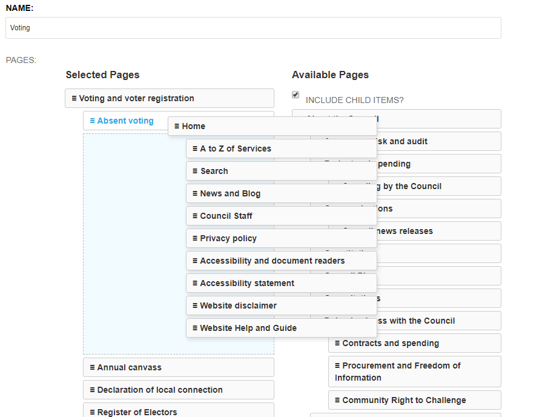
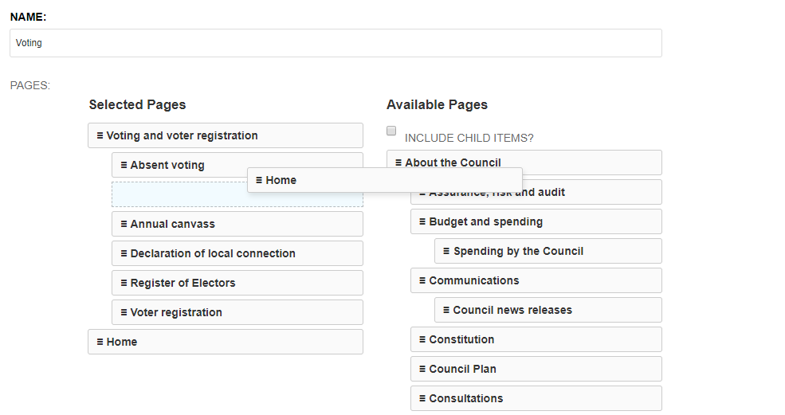

# Django CMS Named Menus

An extension for Django CMS that allows you to create multiple menus like Wordpress


## Replaces Previous Versions

**This replaces the previous versions by Ryan Bagwell and Rogerio Carrasqueira which are no longer actively updated**

Originally forked from:

- https://github.com/rgcarrasqueira/django-cms-named-menus
- https://github.com/ryanbagwell/django-cms-named-menus


## Installation

1. Install with pip `pip install djangocms-named-menus`

2. Add `cms_named_menus` to INSTALLED_APPS

3. Run migrations `python manage.py migrate`


## Upgrading from Previous Version

1. Uninstall previous version with pip `pip uninstall -y django-cms-named-menus`

2. The migrations and code will pick up previous versions correctly.


## Usage

After installation, place the `` template tag where you want your menu to appear.

``` htmldjango

<ul>
  
</ul>
```

Next, create your menu in the admin area using the drag and drop interface.
Drag items with child menu items:




Drag items without child menu items:




## Settings

The following settings can be changed by adding to your project's settings.py file:

1. Override the default cache duration for Named Menus, default = 3600 seconds

``` python
CMS_NAMED_MENUS_CACHE_DURATION = 3600
```


2. Set the application namespaces that can be used with Named Menus as a list, default is CMS pages only - as the page id will not be unique for other applications e.g. Aldryn NewsBlog etc. (default = ['CMSMenu',])

``` python
CMS_NAMED_MENUS_NAMESPACES = ['CMSMenu',]
```

or to allow ALL namespaces:

``` python
CMS_NAMED_MENUS_NAMESPACES = None
```

3. Automatically remove pages that have been unpublished, deleted, or removed from Navigation (default = True)
```python
CMS_NAMED_MENUS_REMOVE_UNAVAILABLE_PAGES = True
```